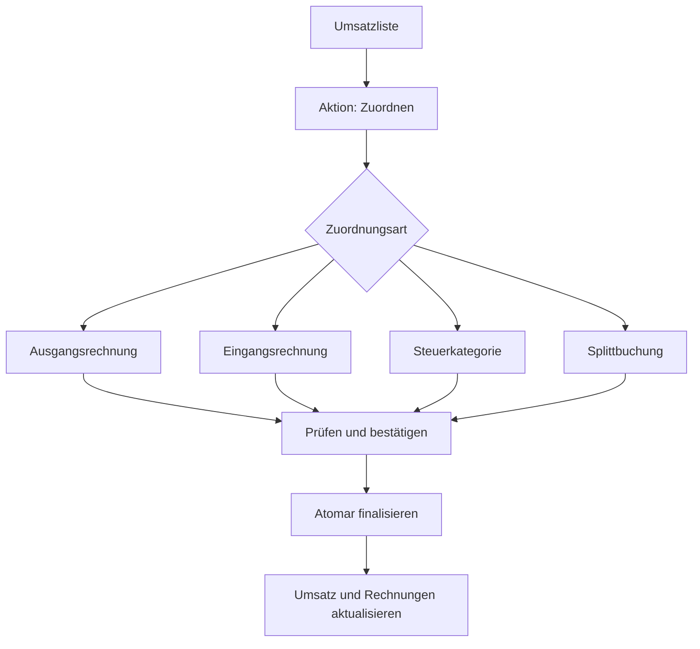

# Plan: Umsatz-Zuordnungsassistent und lokales Vorschlagssystem

## Status und Ziel

Dieses Dokument überführt die sinnvollen Bedienmuster aus den bereitgestellten Referenz-Screenshots in ein eigenständiges Filament-Konzept. Es beschreibt keine Kopie von WISO Mein Büro, sondern ein zum bestehenden Domain-Modell von `filament-accounting` passendes Zielbild.

Das gewünschte Ergebnis:

1. Ein Bankumsatz ist der eindeutige Einstiegspunkt für die Zuordnung.
2. Eine normale Zahlung wird genau einem Ziel zugeordnet.
3. Eine Splittbuchung wird nur verwendet, wenn **ein Bankumsatz mehrere buchhalterische Ziele** enthält.
4. Ausgangs- und Eingangsrechnungen zeigen den Zahlungs- und Zuordnungsstatus in Gegenrichtung.
5. Vorschläge werden lokal, nachvollziehbar und ohne kostenpflichtige KI erzeugt.
6. Keine Zuordnung wird ohne ausdrückliche Bestätigung verbucht.
7. Die bestehende atomare, revisionsfähige Finalisierung bleibt die einzige Buchungsgrenze.

## Bewusste Abgrenzung

Nicht Bestandteil dieses Plans sind:

- Anlagevermögen und Anlagenbuchhaltung;
- die Übernahme von Gestaltung, Texten oder Quellcode des Referenzprodukts;
- automatische Buchungen ohne Benutzerbestätigung;
- externe KI-, LLM- oder SaaS-Dienste;
- Zahlungsaufträge und „offene Überweisungen“;
- Mahnwesen, Skonto und Forderungsausfall als neue Fachmodule;
- Kassenbuch und manuell erzeugte Bankumsätze;
- eine rein deutsche, fest verdrahtete Kontenlogik.

Deutsche Steuerkategorien werden über das bestehende Compliance-Profil bereitgestellt. Andere Länder können eigene Profile und Posting Rules liefern.

## Auswertung der Referenz-Screenshots

Die Screenshots selbst werden wegen der enthaltenen Bank- und Personendaten nicht in dieses öffentliche Repository übernommen. Die Analyse bezieht sich auf folgende Dateien:

| Datei | Relevante Beobachtung |
| --- | --- |
| `Umsätze-mit-Zuordnung.png` | Bankkonto und Zeitraum stehen im Vordergrund. Jede Zeile zeigt Datum, Gegenpartei, Verwendungszweck, verständliche Zuordnung, Betrag und einen Zuordnungsstatus. Nicht, teilweise und vollständig zugeordnet sind sofort erkennbar. |
| `Modal_Zuordnungs-Assistent_Ausgangsrechnung.png` | Die Transaktion bleibt im Kopf sichtbar. Offene Ausgangsrechnungen können nach Betrag, Kunde und Rechnungsnummer gesucht werden; Brutto-, bereits gezahlter und offener Betrag sind getrennt sichtbar. |
| `Modal_Zuordnungs-Assistent_Eingangsrechnung.png` | Dasselbe Muster gilt für Lieferantenrechnungen, ergänzt um interne Belegnummer und Lieferanten-Rechnungsnummer. |
| `Modal_Zuordnungs-Assistent_Steuerkategorie.png` | Steuerkategorien sind nach Einnahme, Ausgabe und Umbuchung filterbar. Kontocode, sprechende Bezeichnung, Suche und Erklärung helfen bei der Entscheidung. |
| `Modal_Zuordnungs-Assistent_Splittbuchung.png` | Ein Split besteht aus mehreren Zeilen unterschiedlicher Art. Jede Zeile hat Ziel, Steuerbezug und Betrag; Bearbeiten und Löschen sind explizit. |
| `Eingangsrechnungen.png` | Zahlungsstatus, Bruttobetrag und offener Betrag sind zentrale Listenspalten. |
| `Ausgangsrechnungen.png` | Rechnungsdatum, Fälligkeit, Kunde, Zahlungsstatus, Brutto- und Restbetrag bilden die wesentliche Arbeitsansicht. |

### Was übernommen werden sollte

- Der Aufruf des Assistenten direkt aus der Umsatzzeile.
- Ein gemeinsamer Assistent für Rechnung, Steuerkategorie und Split.
- Ein unveränderlicher Transaktionskopf mit den Bankdaten während der Zuordnung.
- Sprechende, große Auswahlmöglichkeiten statt eines technischen Typ-Dropdowns.
- Offene Beträge und bereits erfolgte Teilzahlungen in der Rechnungsauswahl.
- Suche, Zeitraum-, Status-, Bankkonto- und Richtungsfilter.
- Ein sichtbarer Restbetrag während einer Splittbuchung.
- Eine verständliche Zuordnungszusammenfassung in der Umsatzliste.
- Statusanzeigen auf Umsatz- **und** Rechnungsseite.
- Erklärungen, warum ein Vorschlag angezeigt wird.

### Was angepasst oder nicht übernommen werden sollte

| Referenzmuster | Entscheidung für Filament |
| --- | --- |
| Separater Button für direkte Zuordnung und Split | Eine Aktion „Zuordnen“. Split ist eine Auswahl innerhalb des Assistenten, kein gleichwertiger Schnellweg. |
| Desktop-Dialog mit festen Abmessungen | Bildschirmbreites Filament-Modal mit responsivem Fallback auf dieselbe Vollseite. |
| Farbpunkte ohne Text | Farbe plus Icon, Text und Tooltip für Barrierefreiheit. |
| „Betrag ungefähr passend“ | Nur ein Such-/Sortierkriterium. Eine Abweichung darf nie still als exakte Übereinstimmung gelten. |
| „Keine Zuordnung“ | Schließt den Assistenten ohne Buchungswirkung. Privatentnahme oder andere nicht betriebliche Vorgänge sind echte Steuerkategorien, keine „Nicht-Zuordnung“. |
| Direkte Kontenauswahl im Hauptweg | Im Standardweg werden Posting Rules mit verständlicher Bezeichnung gewählt. Konten, Gebühren, Rundung und Zwischenkonto liegen unter „Erweitert“. |
| Funktionstasten und proprietäre Desktop-Navigation | Filament-Actions, Tastaturfokus und normale Browser-Navigation. |
| Laufender Saldo | Spätere optionale Erweiterung, nur wenn der Bank-Feed einen belastbaren Anfangs-/Endsaldo und lückenlose Sortierung liefert. |

## Fachliche Leitentscheidung: Einzelzuordnung versus Split

### Einzelzuordnung

Eine Einzelzuordnung verwendet immer den **gesamten Betrag des Bankumsatzes** für genau ein Ziel:

- eine Ausgangsrechnung;
- eine Eingangsrechnung;
- eine Steuerkategorie/Posting Rule;
- ein erweitertes Ziel wie Umbuchung oder Bankgebühr.

Eine Zahlung von 300 EUR auf eine offene Rechnung über 1.000 EUR ist eine **Teilzahlung der Rechnung**, aber **keine Splittbuchung des Umsatzes**. Der Umsatz über 300 EUR wird vollständig dieser einen Rechnung zugeordnet.

Mehrere einzelne Zahlungen auf dieselbe Rechnung bleiben mehrere normale Einzelzuordnungen.

### Splittbuchung

Ein Split ist nur erforderlich, wenn ein einzelner Bankumsatz mindestens zwei Ziele hat, zum Beispiel:

- ein Kunde bezahlt drei Ausgangsrechnungen in einer Überweisung;
- eine Zahlung begleicht eine Rechnung und enthält zusätzlich eine Bankgebühr;
- ein Umsatz verteilt sich auf mehrere Steuerkategorien;
- ein Sammelbetrag begleicht mehrere Eingangsrechnungen.

Ein Split hat mindestens zwei Positionen und die vorzeichenbehaftete Summe muss exakt dem Bankumsatz entsprechen. Diese Regel existiert bereits in `SplitStatementLine` und `FinalizeReconciliation` und bleibt bestehen.

## Bestandsaufnahme des aktuellen Codes

| Bereich | Vorhanden | Konsequenz |
| --- | --- | --- |
| `BankStatementLineResource` | Tabelle, Filter, Zuordnungsbadge, Zielzusammenfassung sowie getrennte Actions „direkt“ und „splitten“ | Actions in eine Aktion „Zuordnen“ zusammenführen und den Assistenten kontextuell öffnen. |
| `ReconciliationPage` | Vollseite für `direct` und `split`, Vorschläge und technische Zieltypen | Als Deep-Link- und Audit-Fallback erhalten, UI-Zustand aber in eine wiederverwendbare Workspace-Komponente verschieben. |
| `AssignStatementLine` | Erzwingt den vollständigen Umsatzbetrag für genau ein Ziel | Unverändert als Service-Grenze für Einzelzuordnungen verwenden. |
| `SplitStatementLine` | Verlangt mindestens zwei Positionen | Unverändert als Service-Grenze für Splits verwenden. |
| `FinalizeReconciliation` | Sperren, Betragsprüfung, Journal, Settlement, Idempotenz, Entity-Grenzen und Audit | Bleibt die einzige finale Schreib- und Buchungsgrenze. |
| `Reconciliation` und `ReconciliationSplit` | Unterstützen Draft/Ready/Posted/Review/Reversed und mehrere Ziele | Für speicherbare Entwürfe nutzbar; aktuell wird dieser Zustand in der UI kaum ausgeschöpft. |
| `BankStatementLine::derivedBadge()` | Unassigned/Partial/Assigned/Review | „Partial“ wird derzeit schon bei irgendeinem Draft-Split gesetzt. Die Summe und ein vollständig vorbereiteter Entwurf müssen getrennt behandelt werden. |
| `SalesInvoiceResource` / `PurchaseInvoiceResource` | Abgeleiteter Zahlungsstatus und Settlement-Anzahl | Um offenen Betrag, Fälligkeit, Filter sowie anklickbare Zahlungsreferenzen ergänzen. Keine zweite Payment-Status-Wahrheit speichern. |
| `DeterministicReconciliationMatcher` | Bewertet Referenz, Rechnungsnummer, Betrag, IBAN, Name, Datum und Richtung | Als harte, erklärbare erste Stufe behalten; Candidate-Auswahl und Scoring erweitern. |
| `ReconciliationMatcher` Contract | Austauschbarer Matcher ist vorhanden | Für einen kombinierten lokalen Matcher weiterverwenden; Binding konfigurierbar machen. |

### Konkrete Lücken

1. Die aktuelle Oberfläche beginnt mit internen Zieltypen wie Ledger Account, Suspense oder Rounding. Für den Standardfall ist das zu technisch.
2. Der Matcher liefert nur offene Posten, keine passenden Posting Rules/Steuerkategorien.
3. Die IBAN-Bewertung liest derzeit `Party::external_reference` statt der vorhandenen normalisierten `PartyBankAccount`-Daten.
4. Ein Vorschlag wird nur automatisch ausgewählt, wenn insgesamt genau ein Vorschlag existiert. Ein klar dominanter Treffer bleibt dadurch oft unselektiert.
5. Es gibt noch kein Lernen aus bestätigten manuellen Zuordnungen.
6. Unvollständige Split-Entwürfe werden nicht als eigener, verlässlich fortsetzbarer Workflow behandelt.
7. Die Umsatz- und Rechnungslisten zeigen noch nicht alle für den Arbeitsablauf wichtigen Restbeträge und Filter.

## Ziel-Workflow in Filament

### 1. Umsatzliste

Empfohlene Standardspalten:

- Zuordnungsstatus;
- Buchungsdatum;
- Gegenpartei;
- Verwendungszweck;
- Zuordnung/Ziel;
- Betrag;
- Bankkonto.

Empfohlene Filter:

- Nicht zugeordnet;
- Teilweise vorbereitet;
- Vollständig vorbereitet;
- Zugeordnet;
- Prüfung erforderlich;
- Bankkonto;
- Zeitraum;
- Einnahme/Ausgabe;
- Betragssuche.

Die Zielspalte zeigt beispielsweise:

- „Ausgangsrechnung RE-2026-123“;
- „Eingangsrechnung INV-456“;
- „Versicherungen (betrieblich)“;
- „Split · 3 Positionen“.

Nach erfolgreicher Finalisierung werden betroffene Tabellenzeile, Badge und Zielzusammenfassung ohne vollständigen Seitenwechsel aktualisiert.

### 2. Öffnen des Assistenten

Die Row Action `Zuordnen` öffnet ein bildschirmbreites Filament-Action-Modal mit festem Header und Footer. Der vorhandene `ReconciliationPage`-Pfad bleibt:

- als direkt verlinkbare Vollseite;
- als responsiver Fallback;
- für die schreibgeschützte Ansicht einer bereits gebuchten Zuordnung;
- für Reversal- und Audit-Aktionen.

Modal und Seite verwenden dieselbe Livewire-/Filament-Komponente und dieselben Services. Es darf keine getrennte Fachlogik entstehen.

### 3. Transaktionskopf

Immer sichtbar und schreibgeschützt:

- Gegenpartei;
- Betrag und Währung;
- Buchungs- und Wertstellungsdatum;
- Bankkonto;
- IBAN/BIC, sofern vorhanden;
- Verwendungszweck;
- End-to-End-ID und Zahlungsreferenz;
- Buchungsart/Quelldaten, sofern der Treiber sie liefert;
- Anhänge/Belege.

Sensible Werte werden nicht in Browser-Logs oder Vorschlags-Telemetrie geschrieben.

### 4. Zuordnungsarten

Die Hauptauswahl besteht aus vier fachlichen Kacheln:

1. **Ausgangsrechnung**
2. **Eingangsrechnung**
3. **Steuerkategorie**
4. **Splittbuchung**

Die Richtung des Umsatzes setzt eine sinnvolle Vorauswahl: Geldeingang bevorzugt Ausgangsrechnungen, Geldausgang bevorzugt Eingangsrechnungen. Die andere Art bleibt wegen Gutschriften, Erstattungen und Sonderfällen erreichbar und zeigt bei ungewöhnlicher Richtung einen Hinweis.

Technische Zwecke wie `ledger_account`, `transfer`, `bank_fee`, `suspense` und `rounding` werden nicht entfernt, sondern unter **Erweitert** gruppiert.

### 5. Rechnungsauswahl

Für Ausgangs- und Eingangsrechnungen werden nur Open Items der aktuellen Legal Entity und passenden Währung angeboten. Die Tabelle enthält:

- Rechnungs- beziehungsweise Lieferanten-Rechnungsnummer;
- interne Belegnummer, sofern vorhanden;
- Kunde/Lieferant;
- Rechnungs- und Fälligkeitsdatum;
- Bruttobetrag;
- bereits zugeordnet;
- offener Betrag;
- Match-Score und verständliche Gründe.

Schnellfilter:

- offen;
- Betrag exakt passend;
- Betrag in konfigurierbarer Suchnähe;
- derselbe Kunde/Lieferant;
- alle.

Eine Einzelrechnung kann auch dann gewählt werden, wenn der Bankbetrag kleiner als der offene Betrag ist. Das ist die normale Teilzahlung.

#### Mehrere Rechnungen in einer Zahlung

Die Rechnungstabelle erlaubt Mehrfachauswahl:

- eine Auswahl bleibt eine Einzelzuordnung;
- ab zwei ausgewählten Rechnungen wechselt der Workspace sichtbar in den Split-Modus;
- pro Rechnung wird standardmäßig höchstens deren offener Betrag eingesetzt;
- der verbleibende Bankbetrag bleibt jederzeit sichtbar;
- es erfolgt keine Finalisierung, solange die Summe nicht exakt stimmt.

Damit wird der häufigste Split-Fall direkt in der Rechnungssuche gelöst. Für eine Mischung aus Rechnung und Steuerkategorie steht weiterhin die allgemeine Split-Ansicht bereit.

### 6. Steuerkategorie

Die vorhandenen `PostingRule`- und `PostingRuleVersion`-Modelle bilden Steuerkategorien ab. Angezeigt werden:

- sprechende Bezeichnung;
- Kontocode nur als sekundäre Information;
- Richtung: Einnahme, Ausgabe oder Umbuchung;
- Steuerhinweis;
- Erklärung;
- Kennzeichnung „Beleg erforderlich“;
- kürzlich verwendet und Favoriten.

Es wird immer die zum Buchungsdatum gültige Version aufgelöst. Deutsche Regeln kommen aus dem DE-Compliance-Profil; generische oder andere Länderprofile bleiben möglich. Keine SKR-Nummer darf als globale Fachlogik fest verdrahtet werden.

### 7. Split-Editor

Der Split-Editor zeigt eine kompakte Positionstabelle mit:

- Art;
- Ziel;
- Steuerinformation;
- Betrag;
- Bearbeiten/Löschen;
- laufender Summe;
- noch zu verteilendem Betrag.

„Position hinzufügen“ öffnet ein Menü für Ausgangsrechnung, Eingangsrechnung, Steuerkategorie und Erweitert. Anlagegut wird nicht angeboten.

Hilfen ohne versteckte Magie:

- Der erste Betrag kann aus einer vorherigen Einzelwahl übernommen werden.
- Eine zweite Position erhält optional den Restbetrag als Vorschlag.
- Bei mehreren gewählten Rechnungen wird je Position der offene Betrag vorgeschlagen.
- Bei Vorzeichenfehler, Überzahlung, anderer Währung oder Summe ungleich Umsatz wird nicht finalisiert.
- Ein Split mit nur einer Position wird als Einzelzuordnung gespeichert beziehungsweise vor dem Buchen dorthin zurückgeführt.

## Statusmodell und Rücknavigation

### Umsatzstatus

| Status | Bedeutung |
| --- | --- |
| Nicht zugeordnet | Kein gebuchter Abgleich und kein Entwurf mit Betrag. |
| Teilweise vorbereitet | Ein gespeicherter Split-Entwurf verteilt nur einen Teil des Umsatzes. |
| Vollständig vorbereitet | Der Entwurf verteilt exakt den Umsatz, wurde aber noch nicht finalisiert. |
| Zugeordnet | Eine aktive `posted` Reconciliation existiert. |
| Prüfung erforderlich | Import-, Währungs-, Konflikt- oder Reversal-Fall verlangt Bearbeitung. |

Dafür sollte `DerivedReconciliationBadge` um einen eindeutigen Ready-Zustand ergänzt und `derivedBadge()` anhand der tatsächlichen Draft-Summe berechnet werden. Eine Teilzahlung einer Rechnung erzeugt **nicht** den Umsatzstatus „teilweise“: Der Bankumsatz ist dabei vollständig zugeordnet.

### Rechnungsstatus

Der Zahlungsstatus bleibt aus Open Item plus nicht reversierten Settlements abgeleitet:

- offen;
- teilweise bezahlt;
- bezahlt;
- überbezahlt/Prüfung, falls ein Altdaten- oder Importkonflikt vorliegt.

In beiden Invoice Resources werden zusätzlich offener Betrag, Fälligkeit, Settlement-Anzahl und ein Link zu den zugehörigen Bankumsätzen angezeigt. Aus einer Rechnung kann eine vorhandene Zahlung geöffnet werden; neue Zuordnungen beginnen weiterhin fachlich beim Bankumsatz.

## Lokales, lernendes Vorschlagssystem

### Grundsatz

Das System ist ein **erklärbares Ranking**, kein autonomer Buchhalter. Es läuft in PHP und SQL innerhalb der Anwendung. Es benötigt weder Netzwerkzugriff noch externe Modelle und bucht niemals automatisch.

Jeder Vorschlag enthält:

- Zieltyp und Ziel;
- Score;
- Konfidenz `high`, `medium` oder `low`;
- lokalisierte Gründe;
- Matcher-/Feature-Version;
- Herkunft: deterministische Regel oder lokale Historie.

### Stufe 1: deterministische Merkmale

Priorität in absteigender Stärke:

1. eindeutige End-to-End-ID, Zahlungsreferenz oder Rechnungsnummer;
2. Legal Entity, Richtung und Währung als harte Grenzen;
3. exakter offener Betrag;
4. normalisierte Gegenpartei-IBAN aus `PartyBankAccount`;
5. normalisierter Name;
6. Fälligkeits- und Buchungsdatumsnähe;
7. Betrag in Suchnähe, klar als Abweichung bezeichnet.

Ein eindeutiger Rechnungsverweis schlägt immer eine erlernte Gewohnheit.

Für Sammelzahlungen kann ein begrenzter Combination Matcher eine exakte Summe mehrerer offener Rechnungen derselben Partei suchen. Zur Laufzeitbegrenzung betrachtet er nur die am besten passenden offenen Posten, eine konfigurierbare maximale Gruppengröße und bricht nach einer kleinen Zahl eindeutiger Lösungen ab. Mehrdeutige Kombinationen werden nicht vorselektiert.

### Stufe 2: Lernen aus bestätigter Historie

Positive Trainingssignale sind ausschließlich:

- manuell finalisierte Einzelzuordnungen;
- ausdrücklich bestätigte Vorschläge;
- bestätigte Split-Positionen.

Nicht verwendet werden:

- Entwürfe;
- reversierte Zuordnungen;
- Suspense-/Prüffälle;
- bloß angezeigte, aber nicht bestätigte Vorschläge.

Aus vergangenen, nicht reversierten Reconciliations werden lokale Muster gebildet, zum Beispiel:

- Gegenpartei-IBAN → Lieferant/Kunde;
- Gegenpartei plus wiederkehrende Zweck-Tokens → Posting Rule;
- Kreditor-ID oder Zahlungsreferenz-Präfix → Partei;
- Name plus Betragsspanne → Posting Rule;
- eigenes Bankkonto plus Gegenkonto → Umbuchung;
- wiederkehrender Tag/Turnus als schwaches Zusatzsignal.

Für Rechnungen wird **nie eine alte Rechnungs-ID wiederverwendet**. Die Historie identifiziert Partei und Muster; das aktuelle Ziel wird danach unter den aktuell offenen Posten gesucht. Für Steuerkategorien wird die logische Posting Rule gelernt und die zum Buchungsdatum gültige Version aufgelöst.

Empfohlene Schutzregeln:

- mindestens drei bestätigte gleichartige Fälle vor einer hohen historischen Konfidenz;
- zeitlicher Verfall alter Beobachtungen;
- widersprüchliche Ziele senken die Konfidenz;
- strikte Trennung nach `legal_entity_id`;
- optional zusätzlich getrennt nach Bankkonto;
- konfigurierte Ausschlüsse für sensible oder seltene Kategorien;
- Historienlernen abschaltbar und zurücksetzbar;
- keine Rohdatenübertragung;
- keine automatische Finalisierung, auch bei 100 % Score.

### Speicherung und Audit

Für die erste Version kann der History Scorer direkt aus gebuchten, nicht reversierten Reconciliations lesen und das Ergebnis kurzzeitig pro Legal Entity cachen. Dadurch entsteht keine undurchsichtige Modelldatei.

Bei Finalisierung wird `match_meta` ergänzt um:

- `matcher_version`;
- `feature_version`;
- `selection_origin` (`manual` oder `suggestion`);
- vorgeschlagener Rang, Score und Gründe;
- gewählter Zieltyp;
- Konfidenz.

Nur für ausdrücklich verworfene Vorschläge ist später eine kleine immutable `accounting_reconciliation_feedback`-Tabelle sinnvoll. Eine materialisierte Pattern-Tabelle wird erst eingeführt, wenn Messungen zeigen, dass die historische SQL-Auswertung zu langsam ist.

### Vorauswahl

- **High**: beste Option darf vorausgewählt werden, bleibt aber ungebucht.
- **Medium**: oben einsortieren, nicht vorauswählen.
- **Low oder mehrdeutig**: nur als Trefferliste anzeigen.
- Eine Vorauswahl setzt einen klaren Abstand zum zweitbesten Treffer voraus; „es gibt nur einen Treffer“ ist nicht länger das alleinige Kriterium.

## Technische Zielarchitektur

### Wiederverwendbarer Workspace

Neue gemeinsame Komponente, beispielsweise:

- `src/Livewire/ReconciliationWorkspace.php`
- `resources/views/livewire/reconciliation-workspace.blade.php`

Sie verwaltet nur UI-Zustand, Kandidatensuche, Entwurf und Validierungsanzeige. Buchungen laufen weiterhin ausschließlich über:

- `AssignStatementLine`;
- `SplitStatementLine`;
- `FinalizeReconciliation`;
- `ReverseReconciliation`.

`BankStatementLineResource` bindet den Workspace in eine Filament Action mit Screen-Breite, sticky Header und sticky Footer ein. `ReconciliationPage` rendert dieselbe Komponente.

### Vorschlags-Pipeline

Empfohlene kleine, austauschbare Bausteine:

- `ReconciliationCandidateProvider`;
- `OpenItemCandidateProvider`;
- `PostingRuleCandidateProvider`;
- `ReconciliationFeatureExtractor`;
- `DeterministicScoreContributor`;
- `HistoricalPatternScoreContributor`;
- `ReconciliationSuggestionRanker`;
- erweitertes `MatchSuggestion` DTO;
- `SuggestionConfidence` Enum.

Der bestehende `ReconciliationMatcher` bleibt der öffentliche Einstiegspunkt. Sein Binding wird aus `config/filament-accounting.php` geladen, statt im Service Provider hart auf `DeterministicReconciliationMatcher` gesetzt zu sein. Integratoren können so einen eigenen vollständig lokalen Matcher einsetzen.

### Entwürfe

Neue Services:

- `SaveReconciliationDraft`;
- `DiscardReconciliationDraft`.

Ein Draft speichert Splits, erzeugt aber weder Journal Entry noch Settlement. Beim Finalisieren wird der aktuelle Entwurf unter Lock erneut validiert und in die bestehende atomare Finalisierung überführt. Pro Bankumsatz darf höchstens ein aktiver Draft existieren; die Datenbank erhält dafür eine geeignete Eindeutigkeitsstrategie beziehungsweise eine transaktional geprüfte Invariante.

## Umsetzungsphasen

### Phase 1 – UX und bestehende Semantik

- [ ] Aus den zwei Row Actions eine Aktion „Zuordnen“ machen.
- [ ] Wiederverwendbaren Reconciliation Workspace für Modal und Vollseite erstellen.
- [ ] Transaktionskopf und vier fachliche Zuordnungsarten umsetzen.
- [ ] Technische Ziele nach „Erweitert“ verschieben.
- [ ] Einzelrechnung als Standard, Split erst ab zwei Zielen.
- [ ] Mehrfachauswahl von Rechnungen mit sichtbarem automatischem Wechsel in Split.
- [ ] Offenen Betrag, Fälligkeit und Zahlungslinks in beiden Invoice Resources ergänzen.
- [ ] Statusfilter und verständliche Zielzusammenfassung in der Umsatzliste ergänzen.
- [ ] Deutsche und englische Übersetzungen vollständig halten.

**Akzeptanz:** Ein Benutzer kann ohne Kenntnis von `SplitPurpose` eine vollständige oder teilweise bezahlte Rechnung korrekt zuordnen und erkennt klar, wann ein Split erforderlich ist.

### Phase 2 – Verlässliche Entwürfe und Status

- [ ] Draft speichern, fortsetzen und verwerfen.
- [ ] Draft-Summe und Restbetrag serverseitig berechnen.
- [ ] Status „teilweise vorbereitet“ und „vollständig vorbereitet“ unterscheiden.
- [ ] Finalisierung eines Drafts mit Locks und erneuter Betrags-/Währungsprüfung.
- [ ] Modal nach Erfolg schließen und betroffene Filament-Tabellen aktualisieren.
- [ ] Unvollständige Drafts dürfen nie Journal oder Settlement erzeugen.

**Akzeptanz:** Ein begonnener Split kann gefahrlos verlassen und fortgesetzt werden; Status und Summe stimmen nach Reload und konkurrierenden Zugriffen.

### Phase 3 – Deterministische Vorschläge verbessern

- [ ] IBAN-Matching auf normalisierte `PartyBankAccount`-Daten umstellen.
- [ ] Posting Rules als Kandidaten aufnehmen.
- [ ] Score, Konfidenz, Abstand zum zweiten Treffer und Gründe modellieren.
- [ ] Eindeutige Referenz vor Betrag und Historie priorisieren.
- [ ] Begrenzte Mehrrechnungs-Summensuche implementieren.
- [ ] Matcher über Konfiguration austauschbar machen.
- [ ] Ambiguität und Währungs-/Richtungsabweichung in der UI sichtbar machen.

**Akzeptanz:** Ein eindeutiger Treffer wird vorausgewählt und erklärt; mehrdeutige Treffer werden nicht still vorausgewählt.

### Phase 4 – Lokales Lernen

- [ ] History Score Contributor aus posted, nicht reversierter Historie implementieren.
- [ ] Gegenpartei-, Purpose-, Posting-Rule- und Partei-Muster normalisieren.
- [ ] Mindestbeobachtungen, Verfall und Konfliktquote konfigurieren.
- [ ] Auswahlherkunft und Matcher-Version in `match_meta` auditieren.
- [ ] Lernen pro Legal Entity deaktivierbar und Cache zurücksetzbar machen.
- [ ] Optionales negatives Feedback erst nach nachgewiesenem Nutzen ergänzen.

**Akzeptanz:** Nach wiederholten manuellen Zuordnungen derselben wiederkehrenden Zahlung wird die passende Kategorie oder Partei höher gerankt, mit Grund „aus bestätigten früheren Zuordnungen“, ohne externe Anfrage und ohne automatische Buchung.

### Phase 5 – Produktivitätsdetails

- [ ] Tastatur- und Screenreader-Bedienung prüfen.
- [ ] „Nächster nicht zugeordneter Umsatz“ anbieten.
- [ ] Favoriten/kürzlich verwendete Steuerkategorien.
- [ ] Optionaler laufender Saldo nur bei verlässlichen Feed-Salden.
- [ ] Performance messen und erst bei Bedarf Patterns materialisieren.

## Tests

### Fachliche Pflichtfälle

- [ ] Ein Umsatz begleicht eine Rechnung vollständig: Einzelzuordnung.
- [ ] Ein Umsatz ist kleiner als der offene Rechnungsbetrag: Einzelzuordnung und Rechnung teilweise bezahlt.
- [ ] Mehrere Umsätze begleichen dieselbe Rechnung: mehrere Einzelzuordnungen.
- [ ] Ein Umsatz begleicht mehrere Rechnungen: Split mit mindestens zwei Positionen.
- [ ] Ein Umsatz enthält Rechnung plus Gebühr/Steuerkategorie: gemischter Split.
- [ ] Split-Summe kleiner oder größer als Umsatz: Finalisierung abgelehnt.
- [ ] Überzahlung eines Open Items ohne zweite Position: abgelehnt beziehungsweise Split erforderlich.
- [ ] Andere Währung, andere Legal Entity oder falsche Richtung: verhindert oder klarer Review-Fall.
- [ ] Reversal stellt Open Item und Vorschlagshistorie korrekt wieder her.
- [ ] Doppelklick und parallele Finalisierung bleiben idempotent.

### Vorschlags-Pflichtfälle

- [ ] Rechnungsnummer in Referenz schlägt Historienmuster.
- [ ] Normalisierte IBAN findet die korrekte Partei.
- [ ] Exakte Summe mehrerer Rechnungen erzeugt einen erklärten Split-Vorschlag.
- [ ] Mehrere gleich starke Treffer erzeugen keine Vorauswahl.
- [ ] Drei konsistente manuelle Kategorien erhöhen den lokalen History Score.
- [ ] Widersprüchliche oder alte Muster senken die Konfidenz.
- [ ] Reversierte Zuordnungen werden nicht als positives Lernen verwendet.
- [ ] Daten einer Legal Entity beeinflussen keine andere.
- [ ] Kein Testpfad führt zu externer Netzwerkkommunikation.
- [ ] Kein Vorschlag wird ohne ausdrückliche Benutzeraktion gebucht.

### UI-Pflichtfälle

- [ ] Modal und Vollseite nutzen dieselbe Komponente und liefern dasselbe Ergebnis.
- [ ] Status ist nicht nur über Farbe erkennbar.
- [ ] Rechnungs- und Umsatzansicht verlinken wechselseitig.
- [ ] Filter und Auswahl bleiben nach Validierungsfehlern erhalten.
- [ ] Mobile Ansicht, Tastaturnavigation sowie DE/EN-Texte sind nutzbar.

## Datei-Blueprint

Voraussichtlich zu ändern:

- `src/Filament/Resources/BankStatementLineResource.php`
- `src/Filament/Pages/ReconciliationPage.php`
- `resources/views/pages/reconciliation.blade.php`
- `src/Filament/Resources/SalesInvoiceResource.php`
- `src/Filament/Resources/PurchaseInvoiceResource.php`
- `src/Models/BankStatementLine.php`
- `src/Reconciliation/DeterministicReconciliationMatcher.php`
- `src/Reconciliation/Data/MatchSuggestion.php`
- `src/Services/FinalizeReconciliation.php`
- `src/FilamentAccountingServiceProvider.php`
- `config/filament-accounting.php`
- Übersetzungsdateien und Reconciliation-/Document-Tests.

Voraussichtlich neu:

- gemeinsamer Reconciliation Workspace samt View;
- Candidate Provider und Score Contributor;
- Feature Extractor, Ranker und Confidence Enum;
- Draft-Services;
- additive Migration für Draft-Invariante und gegebenenfalls Feedback;
- fokussierte Feature- und Livewire-Tests.

## Definition of Done

Die Umsetzung ist abgeschlossen, wenn:

1. Einzelzuordnung und Split in der Oberfläche fachlich nicht mehr verwechselt werden können.
2. Ein Umsatz mit mehreren Rechnungen ohne technische Kenntnisse verteilt werden kann.
3. Umsatz und Rechnung konsistente, wechselseitig navigierbare Zahlungsinformationen zeigen.
4. Vorschläge erklärbar, lokal, mandantengetrennt und reproduzierbar sind.
5. Manuell bestätigte Wiederholungen spätere Rankings verbessern.
6. Kein Vorschlag automatisch verbucht wird.
7. Drafts keine Buchungswirkung haben und finale Zuordnungen weiterhin atomar, idempotent, auditierbar und reversierbar bleiben.
8. Anlagevermögen weder in UI, Kandidaten noch Roadmap auftaucht.
